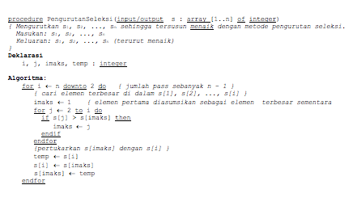
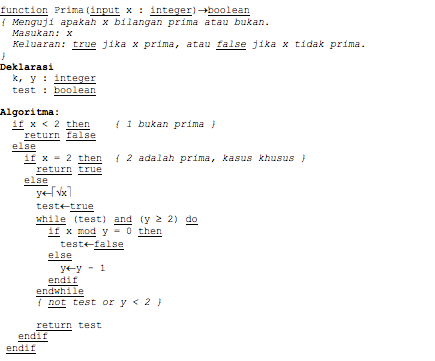
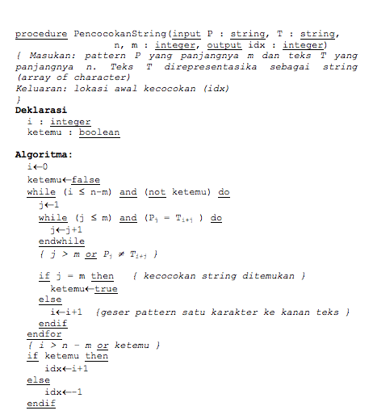

# Tugas RPL Whitebox Testing
[](LICENSE)

> Implementasi beberapa fungsi yang dilakukan skenario pengujian Whitebox Testing 
> dengan menggunakan Basis Path Testing.

### Fungsi 1


### Fungsi 2


### Fungsi 3


### Pengerjaan
Hasil analisis dapat dilihat di [dokumen ini](docs/analisis.pdf).

## Development environment

* OpenJDK 11.0.9
* Gradle 6.7


## Install

```sh
.\gradlew.bat clean build
```

## Usage

```sh
.\gradlew.bat run
```


## Author

👤 **R. Komang Eling Pramuatmaja (185150200111081)**

## 📝 License

Copyright © 2020 [Eling Pramuatmaja](https://github.com/elingp).

This project is [MIT](LICENSE) licensed.
